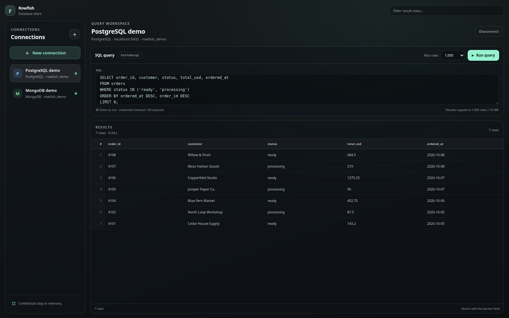
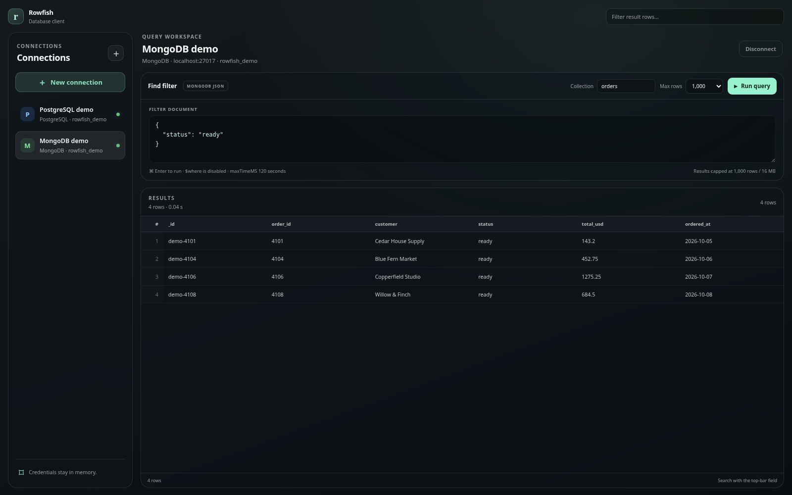

# Rowfish

**A focused desktop query client for PostgreSQL and MongoDB.**

Rowfish brings a SQL editor, MongoDB `find` filters and a fast results grid into one lightweight desktop workspace. It is built with Electron, React and TypeScript.

## See Rowfish





These previews show the real Rowfish interface with synthetic order data. Their connections and query results are fixtures—not live database sessions—and contain no real customer records or credentials.

## What it does

- Save PostgreSQL or MongoDB connection profiles between sessions; passwords and MongoDB URI secrets are encrypted with the operating system credential store.
- Quickly connect to MongoDB by pasting a `mongodb://` or `mongodb+srv://` URI and choosing a display name.
- Browse accessible PostgreSQL databases on a server, inspect schemas and tables in the sidebar, and load a table query with one click.
- Browse accessible MongoDB databases and collections, inspect collection estimates, validators and indexes, and open a collection with one click.
- Run one PostgreSQL statement at a time, or query MongoDB with `find` filters and read-only aggregation pipelines. Insert documents, update or delete matching documents, manage collections and indexes, and drop databases with explicit confirmation.
- Stream query results into a virtualized grid, filter received rows locally, choose a result limit and cancel a running query.
- Keep query work off the UI thread. Results are bounded to 10,000 rows and 16 MB; queries time out after 120 seconds. Rowfish supports up to eight active connections.

MongoDB aggregation is read-only: `$out`, `$merge` and server-side JavaScript operators are blocked. Updates and deletes require non-empty filters; destructive collection/database drops require typing the exact target name. PostgreSQL accepts the SQL statement you enter, including write statements, so take care when running queries.

## Run locally

Requirements: [Bun](https://bun.sh/) 1.x.

```bash
bun install
bun run dev
```

To try the same fictional dataset shown above, use a local PostgreSQL or MongoDB instance and follow [Getting started](docs/getting-started.md). The seed files are [PostgreSQL SQL](docs/examples/postgres.sql) and [MongoDB mongosh JavaScript](docs/examples/mongodb.js).

## Check and package

```bash
bun run test
bun run typecheck
bun run build
bun run start
```

For macOS test builds, run `bun run dist:mac`. See [Mac testing](docs/mac-testing.md) and [Releasing](docs/releasing.md) before packaging or publishing.

## Project documentation

- [Getting started](docs/getting-started.md)
- [Database client](docs/database-client.md)
- [Architecture](docs/architecture.md)
- [Mac testing](docs/mac-testing.md)
- [Releasing](docs/releasing.md)
- [Troubleshooting](docs/troubleshooting.md)

MIT licensed. See [LICENSE](LICENSE).
