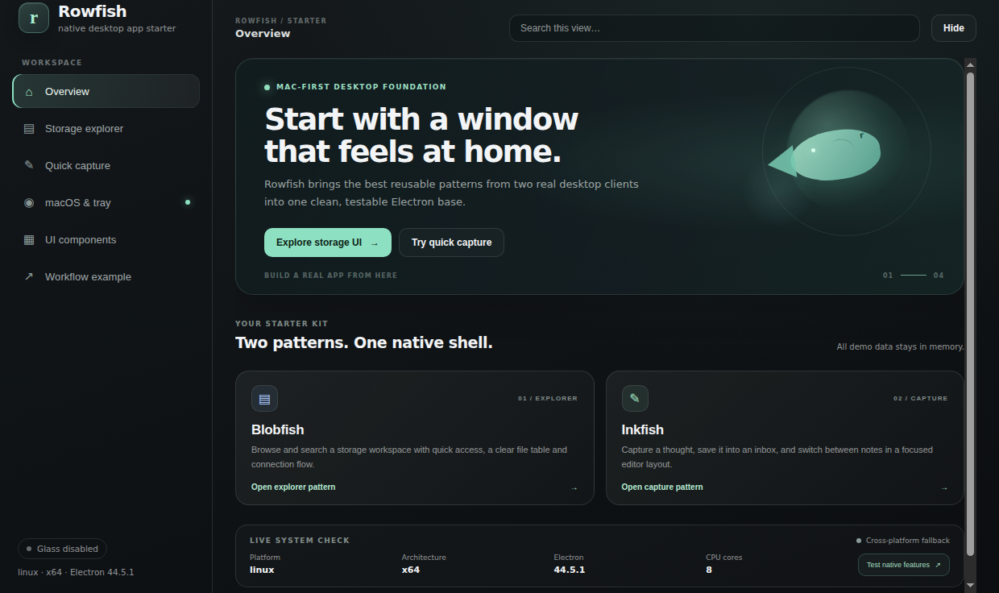

# Rowfish

Rowfish is a **Bun + Electron + React + TypeScript** desktop database client for PostgreSQL and MongoDB, with a Mac-first window shell and a focused query workspace.

The database workspace makes live connections only after you enter connection details and choose **Connect**. Credentials are kept in session memory and are not saved to disk. Query execution runs in dedicated Node workers, results stream in bounded batches, and the UI renders only the visible result rows. Quick capture and the Workflow planner remain local samples; system, notification, native window, tray, Dock and vibrancy calls use the Electron bridge where supported.



*Overview screenshot captured on Linux using the CSS fallback; native macOS materials and title-bar behavior require a Mac to verify.*

## Quick start

Requirements: [Bun](https://bun.sh/) 1.x. macOS 13+ and Xcode Command Line Tools are needed for native Mac checks and packaging; the UI can also run on Linux and Windows.

```bash
bun install
bun run dev
```

The sidebar opens six sections:

- **Overview** — database workspace introduction and live platform details.
- **Database client** — connect to PostgreSQL or MongoDB, run SQL or JSON filters, cancel long queries, and inspect bounded results.
- **Quick capture** — sample inbox and in-memory notes (`⌘ Enter` saves a capture); leaving the view resets added notes.
- **macOS & tray** — vibrancy, tray, Dock, notification and window-lifecycle checks; non-Mac platforms use a CSS fallback.
- **UI components** — IPC ping, runtime versions, controls, buttons and a sample dialog.
- **Workflow example** — a visible plan and log around real system-info and notification APIs. The planner itself is a timed demo, not an AI backend.

The database client contacts a server only when you explicitly connect. It supports up to 8 active connections, caps each result to 10,000 rows or 16 MB, and enforces a 120-second server-side query timeout. See [Database client](docs/database-client.md) for behavior and limitations.

## Verify and package

```bash
bun run test
bun run typecheck
bun run build
bun run start
bun run dist:mac
```

`dist:mac` creates unsigned `.dmg` and `.zip` packages for **Apple Silicon (`arm64`) and Intel (`x64`)** in `release/`. Run the native launch and permission checks on macOS. Unsigned local builds may be blocked by Gatekeeper; signing and notarization are intentionally left to the app owner. See [docs/mac-testing.md](docs/mac-testing.md) and [docs/releasing.md](docs/releasing.md).

## Included foundation

- Translucent macOS `BrowserWindow` with live Electron vibrancy switching and a CSS fallback elsewhere
- Menu-bar tray, Dock badge/hide/restore, notification and window-lifecycle examples
- Typed `contextBridge`/IPC surface, single-instance lock and secure renderer defaults
- Worker-isolated PostgreSQL/MongoDB connections, streamed bounded results, and a virtualized grid, alongside local sample workflows and smoke tests
- Mac packaging configuration for both supported architectures, plus CI checks

## Make Rowfish yours

Update `package.json`, `src/shared/config.ts`, `src/renderer/index.html`, the app/tray icons in `build/` and `assets/`, plus the macOS bundle identifier before distributing a derived app. Put service logic in the main process, validate IPC inputs, and expose only the narrow API the renderer needs. Keep credentials and service SDKs out of renderer code.

## Documentation

- [Getting started](docs/getting-started.md)
- [UI patterns and screenshots](docs/ui-patterns.md)
- [Architecture](docs/architecture.md)
- [Database client](docs/database-client.md)
- [Mac test checklist](docs/mac-testing.md)
- [Mac packaging and releases](docs/releasing.md)
- [Vibrancy and tray behavior](docs/vibrancy-and-tray.md)
- [Troubleshooting](docs/troubleshooting.md)

MIT licensed. See [LICENSE](LICENSE).
