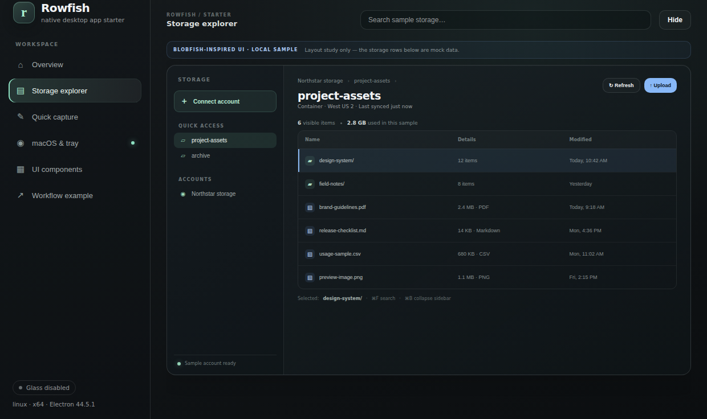
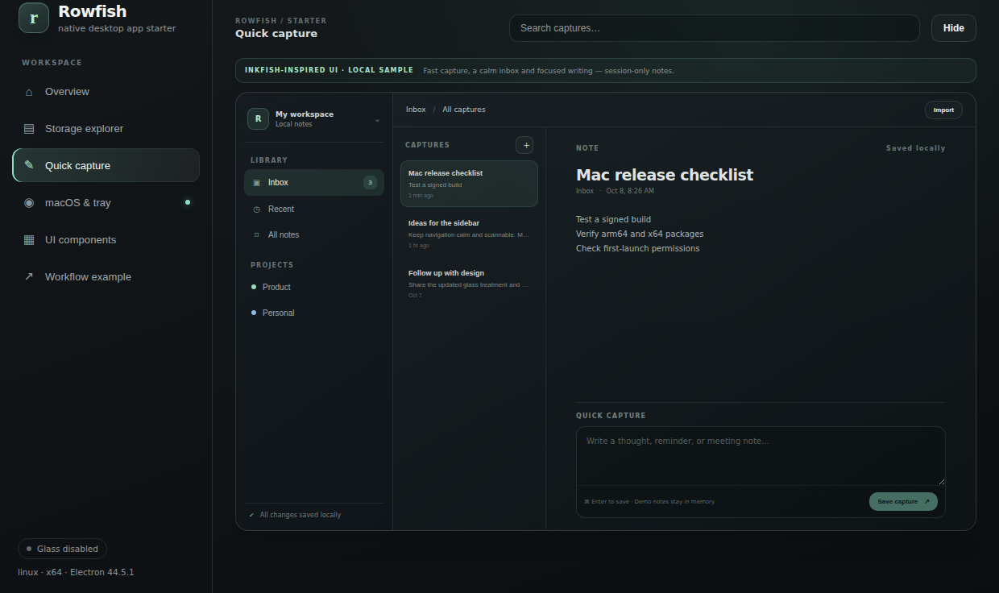

# Getting started

Rowfish is a Bun-managed Electron desktop client for PostgreSQL and MongoDB, with a Mac test lab, a local quick-capture sample, a component gallery and a small workflow demo. Database connections are real and start only after you enter details and choose **Connect**; credentials are held in memory only.

## Requirements

- Bun 1.x
- macOS 13+ for native translucency, Dock and menu-bar checks; the CSS UI also runs on Linux and Windows
- Xcode Command Line Tools on a Mac for native Mac packaging (`xcode-select --install`)

## Run the app

```bash
bun install
bun run dev
```

The sidebar contains these sections:

1. **Overview** — quick links to the database workspace and live platform, architecture, Electron and CPU details.
2. **Database client** — connect to PostgreSQL or MongoDB, run SQL or a MongoDB JSON filter, cancel a long-running query, search received results locally, and inspect a bounded virtualized grid.
3. **Quick capture** — filter the sample inbox, select a note, and save a new in-memory capture with **⌘ Enter**. Added notes reset when you leave this view or close the app.
4. **macOS & tray** — compare live native vibrancy materials on macOS, then try notifications, Dock controls, and hide/restore behavior. Other platforms report the CSS fallback.
5. **UI components** — exercise the typed IPC ping, runtime-version display, form controls, buttons and renderer-side confirmation dialog.
6. **Workflow example** — view a staged plan and activity log. It calls the real `sys.info` and `notify.send` preload APIs; the plan timing and prose are illustrative, not an AI planner.



*The image above records the earlier mock storage-layout study; the live database workflow is in the **Database client** section.*



*Captures are held in React state while this view is open; leaving the view resets added notes. Nothing is written to disk.*

## Verify and package

```bash
bun run test       # query-guard, result-window and demo-logic tests
bun run typecheck  # renderer, preload, main, scripts and config
bun run build      # → out/{main,preload,renderer}/
bun run start      # launch the built application
bun run dist:mac   # unsigned DMG + ZIP, arm64 and x64
```

Run `bun run dist:mac` on a Mac for a native test package. Artifacts are written to `release/`; no signing identity is required for this local build. The app is unsigned and may need the normal first-launch approval or quarantine removal for local testing. Do not distribute it as a signed product until you configure Developer ID signing and notarization.

## Change the starter identity

| File | Update |
|---|---|
| `package.json` | package name, version, description and `build.appId` / `build.productName` |
| `src/shared/config.ts` | `APP_NAME`, tagline, bundle id and window geometry |
| `src/renderer/index.html` | document title and app metadata |
| `build/` and `assets/` | app icon, menu-bar template icon and platform tray icon |
| `build/entitlements.mac.plist` | only the entitlements the derived app actually needs |

Keep secrets and service SDKs out of the renderer. For a real client, implement service operations in `src/main/`, validate untrusted arguments at IPC boundaries, and expose only the required methods through `src/preload/index.ts`.

## Scripts

| Script | Purpose |
|---|---|
| `dev` | Wrapped electron-vite development session with terminal cleanup |
| `dev:bare` | Run electron-vite directly |
| `test` | Run Bun tests in `src/` |
| `typecheck` | Check application and build-tool TypeScript |
| `build` | Compile main, preload and renderer into `out/` |
| `start` | Launch the compiled app |
| `assets` | Regenerate the small tray PNGs without an image dependency |
| `dist:mac` | Package DMG and ZIP for Apple Silicon and Intel |
| `clean` | Remove `out/` and `release/` |
